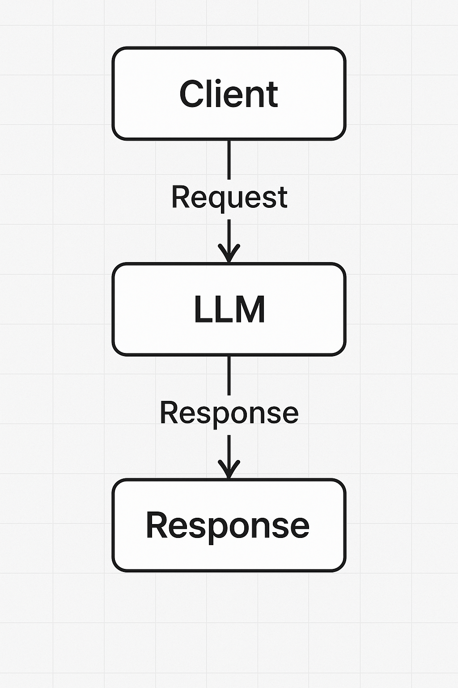

# DESPLIEGUE DE LLMS

Hoy vamos a hablar sobre un tema muy relevante en el mundo de la inteligencia artificial: el despliegue de LLMs. 

Nos centraremos en qué significa desplegar este tipo de modelos, por qué es importante, y exploraremos algunas de las plataformas más utilizadas para realizar este despliegue. El objetivo es entender cómo llevar neustros modelos de desarrollo a producción forma eficiente y hacerlos accesibles ya sea por los usuarios finales como para nuestra propia empresa.


## ¿Qué son las LLMs?

Las LLMs (Large Language Models o Modelos de Lenguaje de Gran Tamaño) son sistemas de inteligencia artificial entrenados con enormes cantidades de texto para comprender y generar lenguaje humano de manera natural. Estos modelos, como GPT (Generative Pre-trained Transformer), pueden realizar tareas como responder preguntas, redactar textos, traducir idiomas o resumir información. Funcionan prediciendo la siguiente palabra en una oración según el contexto, lo que les permite mantener conversaciones coherentes y realizar tareas complejas relacionadas con el lenguaje.

## ¿Qué es un despliegue?

El despliegue (deployment) en machine learning o desarrollo de software es el proceso de llevar un modelo o aplicación desde un entorno de desarrollo a un entorno de producción, donde puede ser utilizado por usuarios reales. Implica preparar el sistema para que sea accesible, escalable y estable, ya sea a través de una API, una aplicación web o un servicio en la nube. Es un paso crucial para poner en práctica los modelos entrenados y permitir su uso en el mundo real.




## 3 opciones de despliegue

### 1. Cloud - Nube:

**La aplicación se aloja en servidores de terceros como AWS, Azure, Google Cloud, etc.**

- **Características:**
  - Accesible desde internet.
  - Alta escalabilidad y disponibilidad.
  - Menor necesidad de infraestructura propia.
- **Ventajas:**
  - Rápido despliegue.
  - Costos iniciales bajos (pago por uso).
  - Mantenimiento y actualizaciones gestionadas por el proveedor.
- **Desventajas:**
  - Dependencia de la conexión a internet.
  - Menor control directo sobre la infraestructura.

### 2. On-promise

**El software se instala y ejecuta en servidores propios, dentro de la empresa.**

- **Características:**
  - Control total sobre la infraestructura y datos.
  - No depende de conexión a internet externa.
- **Ventajas:**
  - Mayor control y personalización.
  - Puede cumplir más fácilmente con requisitos de seguridad o normativas específicas.
- **Desventajas:**
  - Costoso en infraestructura y mantenimiento.
  - Escalabilidad más limitada.
  - Requiere personal técnico interno.

### 3. Edge deploy

**El software se ejecuta cerca del lugar donde se generan o se usan los datos (por ejemplo, dispositivos IoT, gateways, microcentros de datos).**

- **Características:**
  - Procesamiento local de datos.
  - Minimiza la latencia y el uso de ancho de banda.
- **Ventajas:**
  - Muy baja latencia.
  - Mejora la privacidad y seguridad de los datos.
  - Funciona incluso con conectividad limitada a internet.
- **Desventajas:**
  - Gestión distribuida más compleja.
  - Puede requerir hardware especializado.

Cloud VS On-Promise VS Edge deploy

| **Opción de Despliegue** | **Metáfora**                                           | **Explicación Sencilla**                                                          |
| ------------------------ | ------------------------------------------------------ | --------------------------------------------------------------------------------- |
| **Cloud (Nube)**         | 🍽 Pedir comida por delivery                           | Todo se hace fuera de tu casa. Solo recibes el servicio listo, sin preocuparte.   |
| **On-Premise**           | 👨‍🍳 Cocinar en tu propia cocina                      | Tú haces todo: compras, cocinas, limpias. Tienes el control total.                |
| **Edge (En el borde)**   | 🥪 Tener una mini cocina en tu habitación o escritorio | Preparas la comida justo donde la vas a comer, al instante. Rápido y sin esperar. |


## Plataformas de despliegue de LLMs


| Plataforma            | Tipo                                   | Ventajas clave                              | Desventajas                                       | Precios (aprox.)                                             |
| --------------------- | -------------------------------------- | ------------------------------------------- | ------------------------------------------------- | ------------------------------------------------------------ |
| [Replicate](Replicate)             | Hosted pay-per-use                     | Super simple, rapidez, autoescalado         | No control infra, costoso a largo plazo           | GPU T4: \~\$0.36/h; A100: \~\$2.6‑5.0/h; tokens según modelo |
| [Hugging Face](https://huggingface.co)          | Hosted / Serverless                    | Ecosistema completo, fine-tuning, comunidad | Cuotas en Spaces, menos plug‑and‑play generativos | CPU desde \$0.03/h; TPU/Inf2 desde \$0.75‑12/h               |
| [Runpod](https://www.runpod.io)                | GPU rent-serverless                    | Flexibilidad total, buen precio GPU         | Gestión manual, disponibilidad variable           | RTX4090 \~\$0.34‑0.40/h; A100 \~\$1.99/h; Spot más barato    |
| [BentoML](https://www.bentoml.com)               | Framework open-source                  | Control total, portable, CI/CD friendly     | No hospedado, necesitas infra propia              | Gratuito; costos de infraestructura externa                  |
| [Northflank](https://northflank.com)            | Self-host / CI/CD                      | Orquesta apps + modelos + pipelines         | Más complejo, menos inmediato                     | Freemium/demo; precios acorde a uso                          |
| SageMaker / Vertex AI | Infraestructura gestionada (AWS / GCP) | MLOps completa, integración nube            | Costes elevados, complejidad                      | Variable según instancia / región                            |

## Consideraciones éticas y de seguridad antes de desplegar nuestros modelos

- Entrenamiento del modelo sin sesgos ni discriminatorias.
- Implementar filtros de prompts y moderación para evitar el mal uso, creación de noticias falsas, uso dañino, etc.
- Indicar a los usuarios que están interactuando con una IA.
- Ofrecer transparencia, explicabilidad, privacidad, imparcialidad y soldiez.


## Despliegue de LLM en [replicate.com](replicate.com) paso a paso

Replicate.com es una plataforma que permite a desarrolladores y empresas ejecutar modelos de inteligencia artificial en la nube sin necesidad de configurar servidores ni preocuparse por la infraestructura. Ofrece una amplia variedad de modelos ya entrenados, como modelos de texto, imagen o audio, que se pueden utilizar a través de simples llamadas a una API. Es especialmente útil para integrar modelos de machine learning en proyectos de forma rápida y sencilla.


En este ejercicio vamos a descrubrir todo el flujo de trabajo que se necesita para desplegar nuestro LLM en replicate.com.

Para ello he creado un archivo predict.py que utiliza el modelo `tiiuae/falcon-rw-1b` de [HuggingFace.](https://huggingface.co/tiiuae/falcon-rw-1b) Este modelo es gratuito, rápido, requiere poco RAM, compatible con transformers, y a diferencia de otros modelos como pueden ser "mistral-7B-Instruct-v01" que dependen de token de acceso personal (PAT) este modelo es de libre uso.

Para poder desplegar nuestro modelo primero debemos crear una cuenta tanto en [HuggingFace.co](https://huggingface.co/) como en [replicate.com](https://replicate.com/) y crear nuestras variables de entorno y tenerlos presentes para poder usar el CLI de nuestro terminal:

### 1. Variables de entorno (.env)

- `HUGGINGFACE_HUB_TOKEN`
- `replicate CLI auth Token`

### 2. El esquema de carpetas necesaria es la siguiente:

    modelo_llm/
    ├── .env
    ├── predict.py              # setup del modelo
    ├── requirements.txt        # nuestras dependencias

1. Crea y activa el entorno virtual `python3 -m venv .venv && source .venv/bin/activate`
2. Instala las dependencias: `pip install -r requirements.txt`

### 3. requirements.txt más importantes para el despligue

`pip install torch`

`pip install transformers`

`pip install accelerate`    # importante oara el device_amap="auto"

`pip install cog`           # herramienta oficial de replicate para empaquetar modelos en Docker y subirlos

`pip install replicate`


### 4. Autentica HuggingFace para poder usar el modelo

1. `huggingface-cli login`
2. Pega en el terminal tu token personal
3. Add token as git credential? y

### 5. Crea el modelo en [replicate.com](https://replicate.com/create)

Models > Create new model > Create

### 6. Instala Cog

- `sudo curl -o /usr/local/bin/cog -L https://github.com/replicate/cog/releases/latest/download/cog_$(uname -s)_$(uname -m)`
- Ingresa la clave de tu ordenador
- `sudo chmod +x /usr/local/bin/cog`

### 7. Inicializa Cog en tu proyecto

- `cog init`

> [!NOTE]
>
> Este comando creará los archivos cog.yaml y predict.py (archivo que ya teníamos creado y nombrado con nuestro modelo)

    modelo_llm/
    ├── .env
    ├── predict.py              # setup del modelo
    ├── requirements.txt        # nuestras dependencias
    ├── cog.yaml                # empaquetador para ejecutarlo en replicate
    ├── replicate.yaml          # archivo con información sobre el modelo

### 8. Edita cog.yaml en caso necesario

```
build:
  python_version: "3.13"
  python_requirements: requirements.txt

predict: "predict.py:Predictor"
```

### 9. Ejecuta cog

`cog build`

> [!NOTE]
>
> Te tiene que imprimir en el terminal "Image build as cog-nombre-modelo"

### 10. Prueba localmente con Cog

`cog predict -i pregunta="Dime un producto de limpieza que blanquee la ropa"`

> [!NOTE]
>
> Esto debería devolverte en el terminal la respuesta del modelo, y eso significa que el modelo funciona correctamente y está listo para desplegar.

### 11. Sube la imagen a replicate

1. `cog login`
2. Presiona Enter en el terminal
3. Pega el CLI Token de tu cuenta de replicate
4. `cog push r8.im/tu-usuario/nombre-modelo`

### 12. Prueba el modelo en la web o desde la API

Una vez subido, verás una URL como: https://replicate.com/tu-usuario/nombre-modelo


Desde ahí podrás:
- Probar el modelo con inputs reales
- Compartir la demo con otros
- Obtener el endpoint de la API REST

También puedes hacer llamadas desde Python:

```python
import replicate

output = replicate.run(
    "tu-usuario/nombre-modelo:version",
    input={"pregunta": "Dime un producto de limpieza que blanquee la ropa"}
)
print(output)
```
